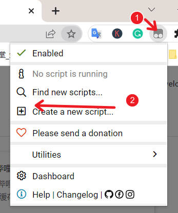
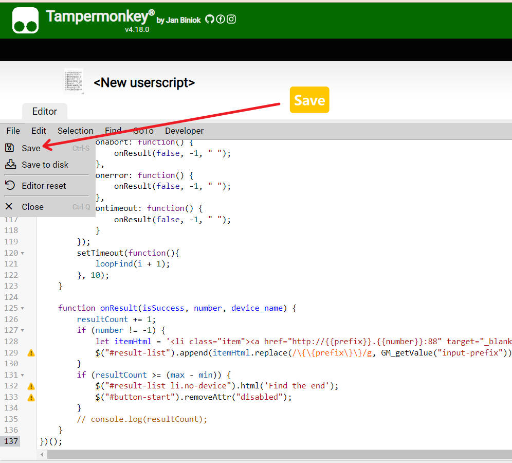
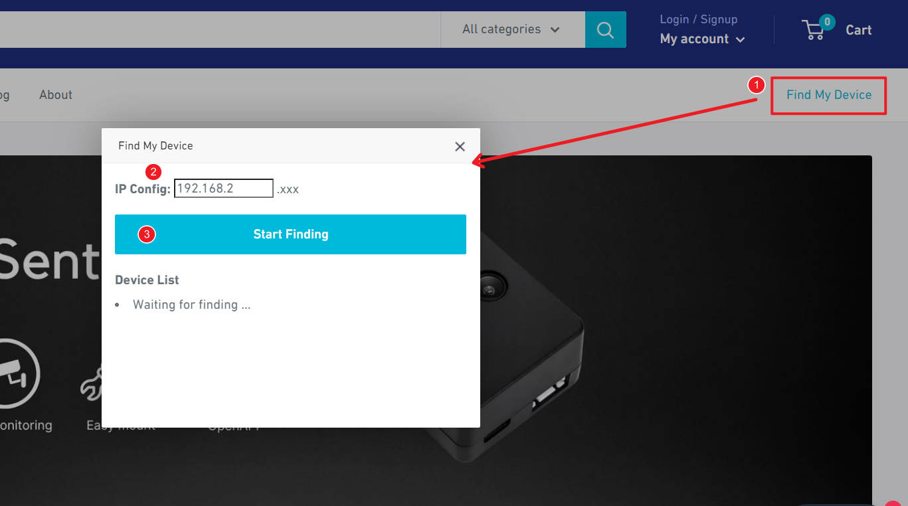
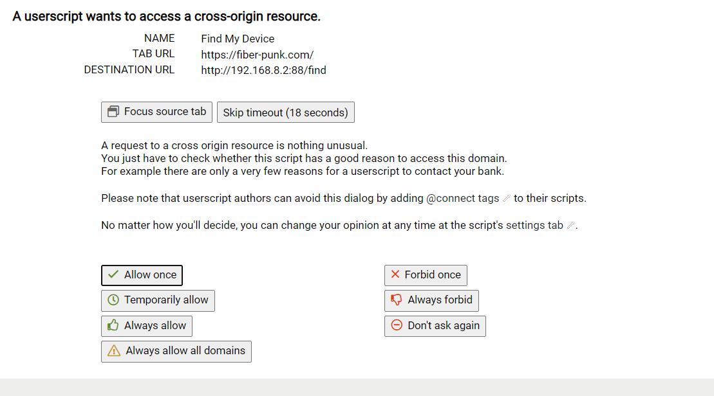
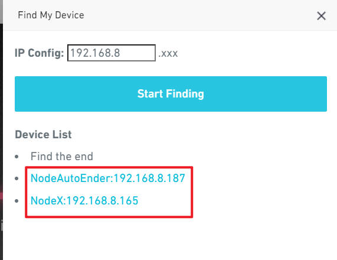

# 1. What find fiberpunk?

Find-fiberpunk.js is a Javascript script based on [Tampermonkey](https://en.wikipedia.org/wiki/Tampermonkey) that allows users to automatically scan Node devices in the LAN from their browser.
[This is a demo video](https://youtu.be/tCWqChy5FhY)

# 2. Install

- **Step1**:install Tampermonkey extension for your browser:
Chrome:
https://chrome.google.com/webstore/detail/tampermonkey/dhdgffkkebhmkfjojejmpbldmpobfkfo/related?hl=en

- **Step2**: Open the extension and click "Creat a new script"

- **Step3**: Copy the javascript code from [here](https://raw.githubusercontent.com/fiberpunk1/FindFiberpunk/main/find-fiberpunk.js), and then paste it to the following edit space:

- **Step4**:Go to http://fiber-punk.com, Click "Find Device" button and input the search IP segment(You can get this from any Node which has connected the wifi)

- **Step5**:Click "Start Finding",if it is the first time to run the script, the following interface will pop up, please select "Always allow all domains".
>ps:The JS code is open source so users can check to see if it does not call on resources that it does not need and does not affect network security. 

Once installed, it is available for use with no additional steps. In the future, you only need to visit fiber-punk.com, and then click "Find Device" to get the Node device in the LAN

